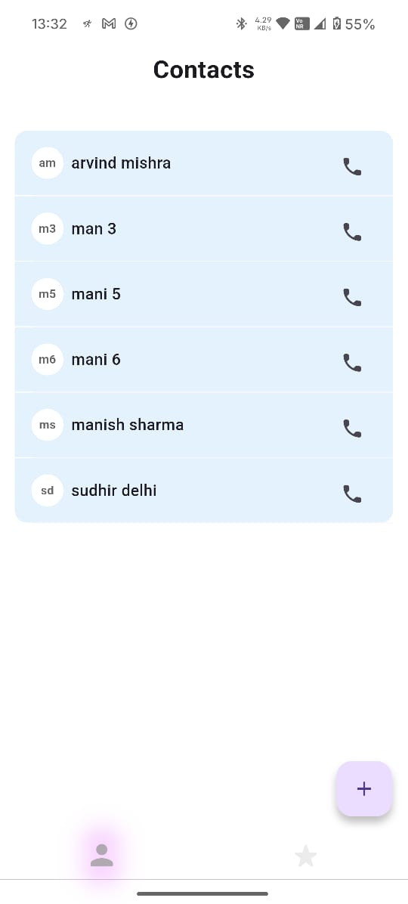
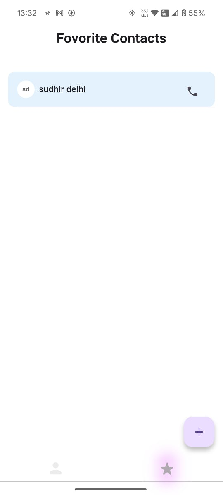
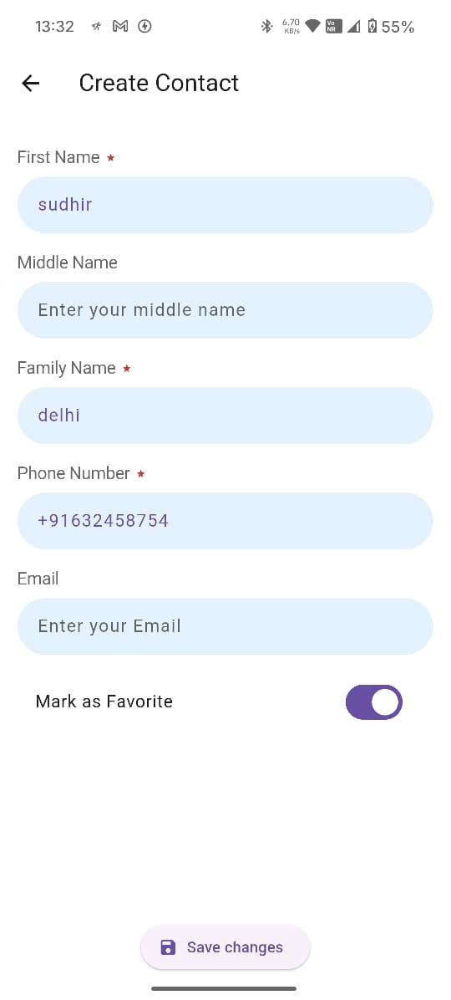
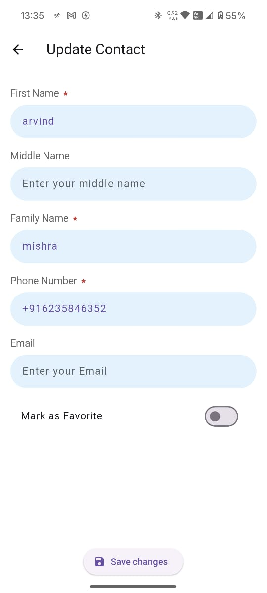
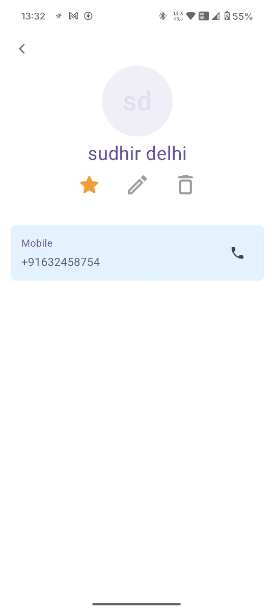

# contact_app

contact app assignment

## Getting Started

This project is a starting point for a Flutter application.git 

# Flutter Contact App 📱

A simple contact management app built with Flutter. It allows users to create, view, favorite, update, and delete contacts — all stored locally using SQLite. The app uses the BLoC pattern for state management.

---

## ✨ Features

- **Dashboard / Home Screen**
  - Contains **two tabs**:  
    🔹 **Contacts**: Displays all saved contacts  
    🔹 **Favorites**: Displays only contacts marked as favorite

- **Create Contact**
  - Tap the **Add (+)** button to open the create contact form
  - Add details like name, phone, email, etc.
  - On saving, the contact appears in the appropriate list(s)

- **Contact Detail View**
  - Tap a contact to open its detail screen
  - Available actions:
    - ✏️ **Edit Contact**
    - ⭐ **Mark as Favorite / Unfavorite**
    - 🗑️ **Delete Contact**

- **Data Persistence**
  - Uses **SQLite** for local storage
  - Supports full **CRUD** (Create, Read, Update, Delete) operations

- **State Management**
  - Implements **BLoC (Business Logic Component)** pattern for efficient state handling

---

## 🛠️ Installation

1. **Clone the repository**
   ```bash
   git clone https://github.com/your-username/your-repo-name.git
   cd your-repo-name


## Screenshots

## 🏠 Home Screen Tab 1

<!--  -->

## 🏠 Home Screen Tab 2

<!--  -->

## ➕ Create Contact Screen

<!--  -->

## 📝 Edit Contact Screen


<!--  -->

## 📋 Contact Details View


<!--  -->

